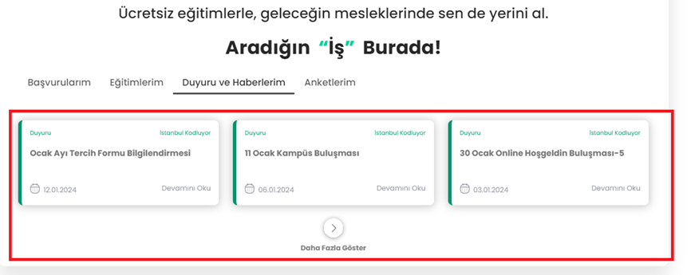

# Test Senaryosu 
Adı : Duyuru ve Haberlerim Görüntüleme
Açıklama : Kullanıcılar e-posta ve şifrelerini girerek sisteme giriş yapabilmelidir ve kendisine ait Duyuru ve Haberleri görütülüyebilmelidir.
Ön Koşul : Test ortamı çalışır ve hazır durumda olmalıdır. Tobeto giriş sayfasına girilmiş olmalıdır.
Input: https://tobeto.com/giris

# Case 1 : Duyuru ve Haberlerim kısmına erişim kontrolü
    Adım 1: Sitenin giriş sayfasına gir.
    https://tobeto.com/giris
    Adım 2: E-posta bölümüne doğru bir mail adresi gir.
    Input: aaa@gmail.com
    Adım 3: Şifre bölümüne doğru bir şifre gir.
    Input: 123456
    Adım 4: Giriş yap butonuna tıkla.
    Adım 5: Hoşgeldiniz panelinde scroll'u aşağı kaydır
Beklenen Sonuç : Kullanıcı kendisine atana duyuru ve haberleri görüntüleyebilmelidir.

# Case : 2 Duyuru ve Haberlerim kısmı 9 modüllerin görüntülenebilmesi
    Adım 1: Sitenin giriş sayfasına gir.
    https://tobeto.com/giris
    Adım 2: E-posta bölümüne doğru bir mail adresi gir.
    Input: aaa@gmail.com
    Adım 3: Şifre bölümüne doğru bir şifre gir.
    Input: 123456
    Adım 4: Giriş yap butonuna tıkla.
    Adım 5: Hoşgeldiniz panelinde scroll'u aşağı kaydır.
    Adım 6: Açılan sayfada, Daha fazla göster butonuna  tıkla.
Beklenen Sonuç : Kullanıcıya atanan ilk "dokuz"  duyuru ve haber görüntülenebilmelidir. 

![alt text][def]

[def]: image-2.png