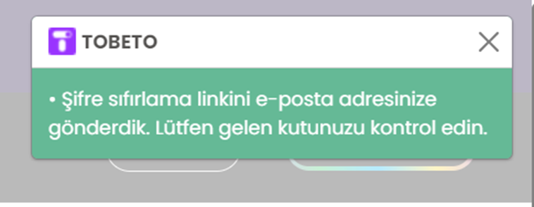
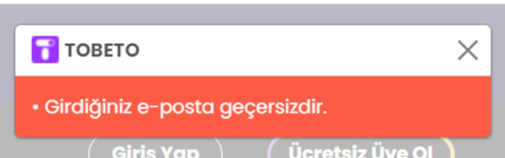

# Test Senaryosu 
Adı : Şifremi unuttum paneli kontrolü.
Açıklama : Şifresini unutan kullanıcı bu sayfayı kullanarak şifresini yenileyebilmelidir.
Ön Koşul : Test ortamı çalışır ve hazır durumda olmalıdır. Tobeto sifremi-unuttum sayfasına girilmiş olmalıdır.
Input: https://tobeto.com/sifremi-unuttum

# Case 1: Şifre sıfırlama e-postası gönderme.
	Adım1: Tobeto şifremi unuttum sayfasına gir.
	Adım2: E-posta kısmına geçerli bir e-posta adresi gir.
	İnput: aaa@gmail.com
	Adım3: Gönder butonuna tıkla.
Beklenen Sonuç : Kullanıcı gönder tuşuna bastığında girilen e-posta adresi sistemde bulunursa pop up şeklinde ekteki mesajla karşılaşmalıdır. Giriş sayfasına yönlendirilmelidir.

# Case 2: Şifre sıfırlama durumunda hatalı e-posta girilmesi.
	Adım1: Tobeto şifremi unuttum sayfasına gir.
	Adım2: E-posta kısmına geçersiz bir e-posta adresi gir.
	İnput: geçersiz@gmail.com
	Adım3: Gönder butonuna tıkla.
Beklenen Sonuç : Kullanıcı gönder tuşuna bastığında girilen e-posta adresi geçersiz bir e-posta adresi ise pop up şeklinde ekteki mesajla karşılaşmalıdır.
 
 