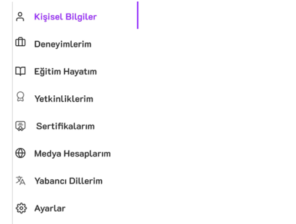
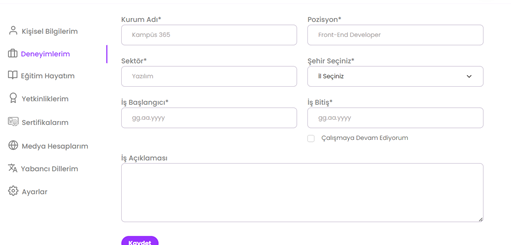
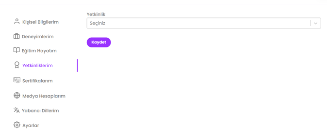
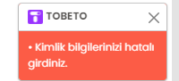
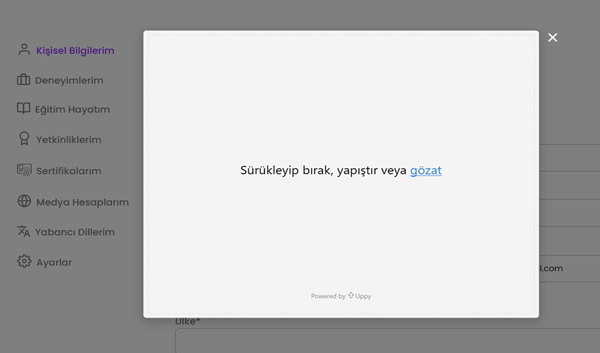
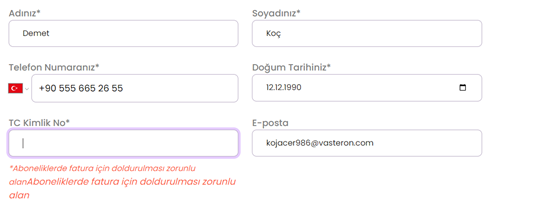
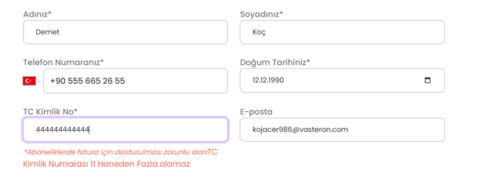
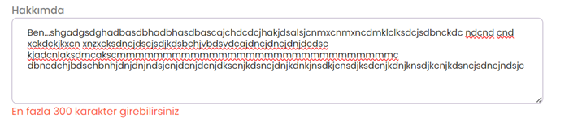

# PROFİLİNİ OLUŞTUR
# Test Senaryosu 
Adı : Kullanıcı Profili Oluşturma
Açıklama : Kullanıcıların :“Kişisel Bilgilerim”, “Deneyimlerim”, “Eğitim Hayatım”, “Yetkinliklerim”, “Sertifikalarım”, “Medya Hesaplarım”, “Yabancı Dillerim” ve “Ayarlar” başlıklarına erişebilmelerinin testi yapılacaktır.
Ön Koşul : Test ortamı çalışır ve hazır durumda olmalıdır. Kullanıcının kayıtlı ve geçerli  hesabı bulunmalıdır. Tobeto web sayfasına gidilmelidir.
https://tobeto.com/profilim/profilimi-duzenle/kisisel-bilgilerim
# Case 1 :  Profil başlıklarının  kontrolü 
    Adım 1: Call Test(Test Senaryosu 1-Case1 :Başarılı Giriş Kontrolü)
    Adım 2: ‘Profilimi Oluştur’ modülünde ‘Başla’ butonuna tıkla.
Beklenen Sonuç: ‘Kişisel Bilgilerim’ başlığının olduğu alanının açılması

    
    Adım 3:” Deneyimlerim” başlığına tıkla.

Beklenen Sonuç: ‘Deneyimlerim’ başlığının olduğu alanının açılması.

    Adım 4:” Yetkinliklerim” başlığına tıkla.
Beklenen Sonuç: ‘Yetkinliklerim’ başlığının olduğu alanının açılması.

# Case 2: Kişisel Bilgilerin Başarısız Girilmesi kontrolü 

    Adım 1: Call Test(Test Senaryosu 1-Case1 :Başarılı Giriş Kontrolü)
    Adım 2: ‘Profilimi Oluştur’ modülünde ‘Başla’ butonuna tıkla.
    Adım 3: “Adınız” alanına adını gir.
    input: Demet
    Adım 4: “Soyadınız” alanına soyadını gir.
    input: Koç
    Adım 5: Telefon numarası kısmından ülke kodu alanından inputu seç.
    input: Türkiye
    Adım 6: “Telefon Numaranız” alanına numara gir.
    input: +90 555 665 26 55
    Adım 7: “Doğum Tarihiniz” alanına inputu gir ya da takvim işaretine tıkla takvimden seç.       
    input: 12.12.1990
    Adım 8: “T.C. Kimlik No” kayıtlı olmayan 
    input: 44444444444
    Adım 9:‘Ülke’ alanını gir.
    input:Türkiye
    Adım 10: “İl” alanına tıkla ve listeden ili seç.
    input: İstanbul
    Adım 11: “İlçe” alanına tıkla ve listeden ilçeyi seç.
    input: Avcılar
    Adım 12: “Mahalle / Sokak” alanına bilgileri gir.
    input: Murat Mah. Sancar Sok.
    Adım 13: “Hakkımda” alanına bilgileri gir.
    input: Yazılım Test mühendisliği alanında Tobetoda eğitim alıyorum.
    Adım 14: Kaydet butonuna tıklayın.
Beklenen Sonuç : "• Kimlik bilgilerinizi hatalı girdiniz."  şeklinde bir bildirim ekranda  görülmelidir.

# Case 3:  Profil resmi ekle kontrolü
    Adım 1: Call Test(Test Senaryosu 1-Case1 :Başarılı Giriş Kontrolü)
    Adım 2: ‘Profilimi Oluştur’ modülünde ‘Başla’ butonuna tıkla.
    Adım 3: Görsel yükleme butonuna tıkla.
Beklenen Sonuç: Ekranda sırasıyla ‘Sürükleyerek bırak’, ‘yapıştır’ ve ‘gözat’ seçeneklerinin sunulduğu pencerenin açılması.

# Case 4: “ TC Kimlik No “ boş bırakma kontrolü
    Adım 1: “Adınız” alanına adını gir.
    input: Demet
    Adım 2: “Soyadınız” alanına soyadını gir.
    input: Koç
    Adım 3: Telefon numarası kısmından ülke kodu alanından inputu seç.
    input: Türkiye
    Adım 4: “Telefon Numaranız” alanına numara gir.
    input: +90 555 665 26 55
    Adım 5: “Doğum Tarihiniz” alanına inputu gir ya da takvim işaretine tıkla ve takvimden seç.
    input: 12.12.1990
    Adım 6: “T.C. Kimlik No” alanını boş bırak.
    input1: 
Beklenen Sonuç: “*Aboneliklerde fatura için doldurulması zorunlu alanAboneliklerde fatura için doldurulması zorunlu alan” uyarısı görünmelidir.

# Case 5: “ TC Kimlik No “ 11 haneden fazla kontrolü
    Adım 1: “Adınız” alanına adını gir.
    input: Demet
    Adım 2: “Soyadınız” alanına soyadını gir.
    input: Koç
    Adım 3: Telefon numarası kısmından ülke kodu alanından inputu seç.
    input: Türkiye
    Adım 4: “Telefon Numaranız” alanına numara gir.
    input: +90 555 665 26 55
    Adım 5: “Doğum Tarihiniz” alanına inputu gir ya da takvim işaretine tıkla ve takvimden seç.
    input: 12.12.1990
    Adım 6: “T.C. Kimlik No” alanına 11 haneden fazla rakam gir.
    input1: 444444444444
Beklenen Sonuç: “*Aboneliklerde fatura için doldurulması zorunlu alanTC Kimlik Numarası 11 Haneden Fazla olamaz” uyarısı görünmelidir.

# Case 5: “ Hakkında ”alanı karakter kontrolü

    
    Adım 1: Call Test(Test Senaryosu 1-Case1 :Başarılı Giriş Kontrolü)
    Adım 2: ‘Profilimi Oluştur’ modülünde ‘Başla’ butonuna tıkla.
    Adım 3: “Adınız” alanına adını gir.
    input: Demet
    Adım 4: “Soyadınız” alanına soyadını gir.
    input: Koç
    Adım 5: Telefon numarası kısmından ülke kodu alanından inputu seç.
    input: Türkiye
    Adım 6: “Telefon Numaranız” alanına numara gir.
    input: +90 555 665 26 55
    Adım 7: “Doğum Tarihiniz” alanına inputu gir ya da takvim işaretine tıkla takvimden seç.       
    input: 12.12.1990
    Adım 8: “T.C. Kimlik No” kayıtlı bir numara gir.
    input: 44444444444
    Adım 9:‘Ülke’ alanını gir.
    input:Türkiye
    Adım 10: “İl” alanına tıkla ve listeden ili seç.
    input: İstanbul
    Adım 11: “İlçe” alanına tıkla ve listeden ilçeyi seç.
    input: Avcılar
    Adım 12: “Mahalle / Sokak” alanına bilgileri gir.
    input: Murat Mah. Sancar Sok.
    Adım 13: “Hakkımda” alanına 300 karakterden fazla bilgi gir.
    Adım 14: Kaydet butonuna tıklayın.
Beklenen Sonuç :"En fazla 300 karakter girebilirsiniz" uyarısının görünmelidir.

