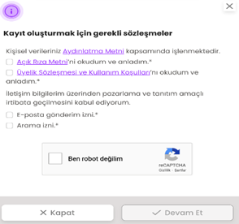
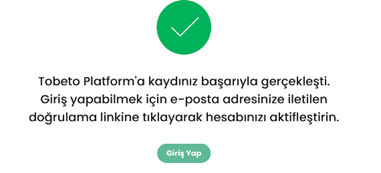
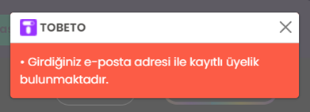
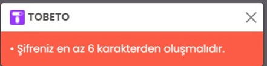
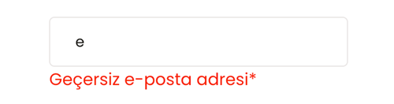
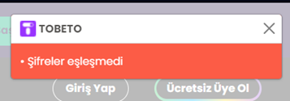
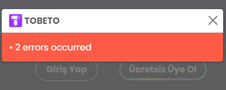

# Test Senaryosu 
Adı : Kayıt Ol Paneli Kontrolü
Açıklama : Kullanıcılar henüz sisteme üye değilse e-posta ve şifrelerini girerek sisteme kayıt yapabilmelidir.
Ön Koşul : Test ortamı çalışır ve hazır durumda olmalıdır. Tobeto kayıt sayfasına girilmiş olmalıdır.
Input: https://tobeto.com/kayit-ol

# Case 1 : Başarılı Kayıt Ol Kontrolü
    Adım 1: Sitenin kayıt sayfasına gir.
    https://tobeto.com/kayit-ol
    Adım 2: “Ad” bölümüne adını gir.
    Input: Doğukan
    Adım 3: “Soyad” bölümüne soyadını gir.
    Input: Arslan
    Adım 4: “E-posta” bölümüne geçerli bir mail adresi gir.
    Input: aaa@gmail.com
    Adım 5: “Şifre” bölümüne en az 6 karakterli bir şifre gir.
    Input: 123456
    Adım 6: “Şifre Tekrar” bölümüne ilk girilen şifreyi gir.
    Input: 123456
    Adım 7: “Kayıt ol” butonuna tıkla.
Beklenen Sonuç : Kayıt ol butonuna tıkladıktan sonra kayıt oluşturmak için sözleşmeler başlıklı bir pop-up açılmalıdır.

                   

    Adım 8 :Açılan pop-up’da aydınlatma metnine tıkla.
    Adım 9 : Açılan pop-up’da “Açık Rıza Metni’ni okudum ve anladım .” linkine tıkla. 
    Adım 9.1: Checkbox’ını işaretle.
    Adım 10: Açılan pop-up’da “Üyelik Sözleşmesi ve Kullanım Koşulları’nı okudum ve anladım.” Checkbox’ını işaretle.
    Adım 11: Açılan pop-up’da “E-posta gönderim izni.”  Checkbox’ını işaretle.
    Adım 12: Açılan pop-up’da “Arama izni.”  Checkbox’ını işaretle.
    Adım 13: Arama iznine tıklandıktan sonra açılan telefon numarası alanını doldur.
    Adım 14: Açılan pop-up’da “Ben robot değilim” Checkbox’ını işaretle.
    Adım 15: “Devam Et” butonuna tıkla.

Beklenen Sonuç : Kayıt başarıyla gerçekleşti bildirimi alınmalıdır.

# Case 2: Girdiğiniz e posta adresi ile kayıtlı üyelik bulunmaktadır uyarısının alınması.
    Adım 1: Sitenin kayıt sayfasına gir.
    https://tobeto.com/kayit-ol
    Adım 2: “Ad” bölümüne adını gir.
    Input: Doğukan
    Adım 3: “Soyad” bölümüne soyadını gir.
    Input: Arslan
    Adım 4: “E-posta” bölümüne kayıtlı bir mail adresi gir.
    Input: kayıtlı@gmail.com
    Adım 5: “Şifre” bölümüne en az 6 karakterli bir şifre gir.
    Input: 12345
    Adım 6: “Şifre Tekrar” bölümüne ilk girilen şifreyi gir.
    Input: 123456
    Adım 7: “Kayıt ol” butonuna tıkla.
    Adım 8: Açılan pop-up’da “Açık Rıza Metni’ni okudum ve anladım.” Checkbox’ını işaretle.
    Adım 9: Açılan pop-up’da “Üyelik Sözleşmesi ve Kullanım Koşulları’nı okudum ve anladım.” Checkbox’ını işaretle.
    Adım 10: Açılan pop-up’da “E-posta gönderim izni.”  Checkbox’ını işaretle.
    Adım 11: Açılan pop-up’da “Arama izni.”  Checkbox’ını işaretle.
    Adım 12: Arama iznine tıklandıktan sonra açılan telefon numarası alanını doldur.
    Adım 13: Açılan pop-up’da “Ben robot değilim” Checkbox’ını işaretle.
    Adım 14: “Devam Et” butonuna tıkla.

Beklenen Sonuç :   “Girdiğiniz e posta adresi ile kayıtlı üyelik bulunmaktadır.” Uyarısı alınmalıdır.

  
	
# Case 3: Kayıt ol sırasında istenen telefon numarası  karakter kontrolü
    Adım 1: Sitenin kayıt sayfasına gir.
    https://tobeto.com/kayit-ol
    Adım 2: “Ad” bölümüne adını gir.
    Input: Doğukan
    Adım 3: “Soyad” bölümüne soyadını gir.
    Input: Arslan
    Adım 4: “E-posta” bölümüne geçerli bir mail adresi gir.
    Input: aaa@gmail.com
    Adım 5: “Şifre” bölümüne en az 6 karakterli bir şifre gir.
    Input: 123456
    Adım 6: “Şifre Tekrar” bölümüne ilk girilen şifreyi gir.
    Input: 123456
    Adım 7: “Kayıt ol” butonuna tıkla.
    Adım 8 :Açılan pop-up’da aydınlatma metnine tıkla.
    Adım 9 : Açılan pop-up’da “Açık Rıza Metni’ni okudum ve anladım .” linkine tıkla. 
    Adım 9.1: Checkbox’ını işaretle.
    Adım 10: Açılan pop-up’da “Üyelik Sözleşmesi ve Kullanım Koşulları’nı okudum ve anladım.” Checkbox’ını işaretle.
    Adım 11: Açılan pop-up’da “E-posta gönderim izni.”  Checkbox’ını işaretle.
    Adım 12: Açılan pop-up’da “Arama izni.”  Checkbox’ını işaretle.
    Adım 13: Açılan textarea da bir Ülke adı  seçimi yap.
    İnput:Türkiye
    Adım 14: Açılan textarea kısmına 10 karakterden az bir numara gir.
    Input:+90 1234
    Adım 15: Açılan pop-up’da “Ben robot değilim” Checkbox’ını işaretle.
    Adım 16: “Devam Et” butonuna tıkla.

Beklenen Sonuç : “En az 10 karakter girmelisiniz.” uyarısı gelmelidir.

    Adım  17 : Açılan textarea kısmına 10 karakterden fazla bir numara gir.
    Input:+90 4357653794753

Beklenen Sonuç : “En fazla 10 karakter girmelisiniz.” uyarısı gelmelidir.

# Case 4: Şifrenin karakter sayı kontrolü.
    Adım 1: Sitenin kayıt sayfasına gir.
    https://tobeto.com/kayit-ol
    Adım 2: “Ad” bölümüne adını gir.
    Input: Doğukan
    Adım 3: “Soyad” bölümüne soyadını gir.
    Input: Arslan
    Adım 4: “E-posta” bölümüne geçerli bir mail adresi gir.
    Input: aaa@gmail.com
    Adım 5: “Şifre” bölümüne 6 karakterden az bir şifre gir.
    Input: 12345
    Adım 6: “Şifre Tekrar” bölümüne ilk girilen şifreyi gir.
    Input: 12345
    Adım 7: “Kayıt ol” butonuna tıkla.
    Adım 8: Açılan pop-up’da “Açık Rıza Metni’ni okudum ve anladım.” Checkbox’ını işaretle.
    Adım 9: Açılan pop-up’da “Üyelik Sözleşmesi ve Kullanım Koşulları’nı okudum ve anladım.” Checkbox’ını işaretle.
    Adım 10: Açılan pop-up’da “E-posta gönderim izni.”  Checkbox’ını işaretle.
    Adım 11: Açılan pop-up’da “Arama izni.”  Checkbox’ını işaretle.
    Adım 12: Arama iznine tıklandıktan sonra açılan telefon numarası alanını doldur.
    Adım 13: Açılan pop-up’da “Ben robot değilim” Checkbox’ını işaretle.
    Adım 14: “Devam Et” butonuna tıkla.

Beklenen Sonuç :   "Şifreniz en az 6 karakterden oluşmalıdır." uyarısı almalıdır.

# Case 5 : Geçersiz E-posta kontrolü 
	
    Adım 1: E-posta kutusuna geçersiz bir E-posta adresi yaz.
	İnput: E-posta = e

Beklenen Sonuç :   “Geçersiz e-posta adresi*” Uyarısı görülmelidir.

 

# Case 6: Şifre tekrarı kontrolü.
    Adım 1: Sitenin kayıt sayfasına gir.
    https://tobeto.com/kayit-ol
    Adım 2: “Ad” bölümüne adını gir.
    Input: Doğukan
    Adım 3: “Soyad” bölümüne soyadını gir.
    Input: Arslan
    Adım 4: “E-posta” bölümüne geçerli bir mail adresi gir.
    Input: aaa@gmail.com
    Adım 5: “Şifre” bölümüne en az 6 karakterli bir şifre gir.
    Input: 123456
    Adım 6: “Şifre Tekrar” bölümüne ilk girilen şifreden farklı bir şifre gir.
    Input: asdasd
    Adım 7: “Kayıt ol” butonuna tıkla.
    Adım 8: Açılan pop-up’da “Açık Rıza Metni’ni okudum ve anladım.” Checkbox’ını işaretle.
    Adım 9: Açılan pop-up’da “Üyelik Sözleşmesi ve Kullanım Koşulları’nı okudum ve anladım.” Checkbox’ını işaretle.
    Adım 10: Açılan pop-up’da “E-posta gönderim izni.”  Checkbox’ını işaretle.
    Adım 11: Açılan pop-up’da “Arama izni.”  Checkbox’ını işaretle.
    Adım 12: Arama iznine tıklandıktan sonra açılan telefon numarası alanını doldur.
    Adım 13: Açılan pop-up’da “Ben robot değilim” Checkbox’ını işaretle.
    Adım 14: “Devam Et” butonuna tıkla.
Beklenen Sonuç : "Şifreler eşleşmedi" uyarısı almalıdır.

 
# Case 7: Girilen bilgilerde 2 farklı hatalı kısım olduğunda.
    Adım 1: Sitenin kayıt sayfasına gir.
    https://tobeto.com/kayit-ol
    Adım 2: “Ad” bölümüne adını gir.
    Input: Doğukan
    Adım 3: “Soyad” bölümüne soyadını gir.
    Input: Arslan
    Adım 4: “E-posta” bölümüne geçersiz bir mail adresi gir.
    Input: geçersiz@gmail.com
    Adım 5: “Şifre” bölümüne geçersiz bir şifre gir.
    Input: asdas
    Adım 6: “Şifre Tekrar” bölümüne ilk girilen şifreyi gir.
    Input: asdas
    Adım 7: “Kayıt ol” butonuna tıkla.
    Adım 8: Açılan pop-up’da “Açık Rıza Metni’ni okudum ve anladım.” Checkbox’ını işaretle.
    Adım 9: Açılan pop-up’da “Üyelik Sözleşmesi ve Kullanım Koşulları’nı okudum ve anladım.” Checkbox’ını işaretle.
    Adım 10: Açılan pop-up’da “E-posta gönderim izni.”  Checkbox’ını işaretle.
    Adım 11: Açılan pop-up’da “Arama izni.”  Checkbox’ını işaretle.
    Adım 12: Arama iznine tıklandıktan sonra açılan telefon numarası alanını doldur.
    Adım 13: Açılan pop-up’da “Ben robot değilim” Checkbox’ını işaretle.
    Adım 14: “Devam Et” butonuna tıkla.

Beklenen Sonuç : "2 errors occurred" uyarısı almalıdır.
  

 

